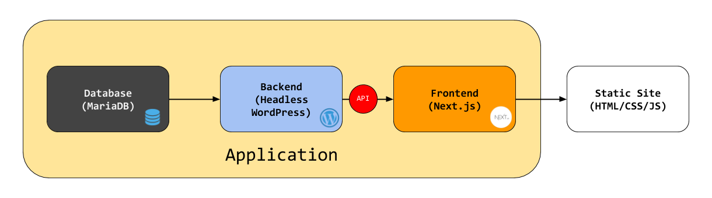
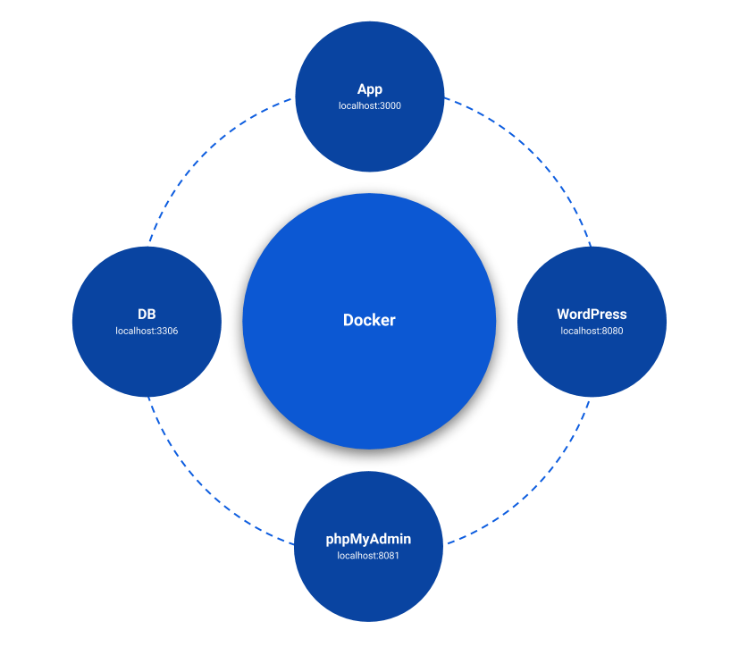
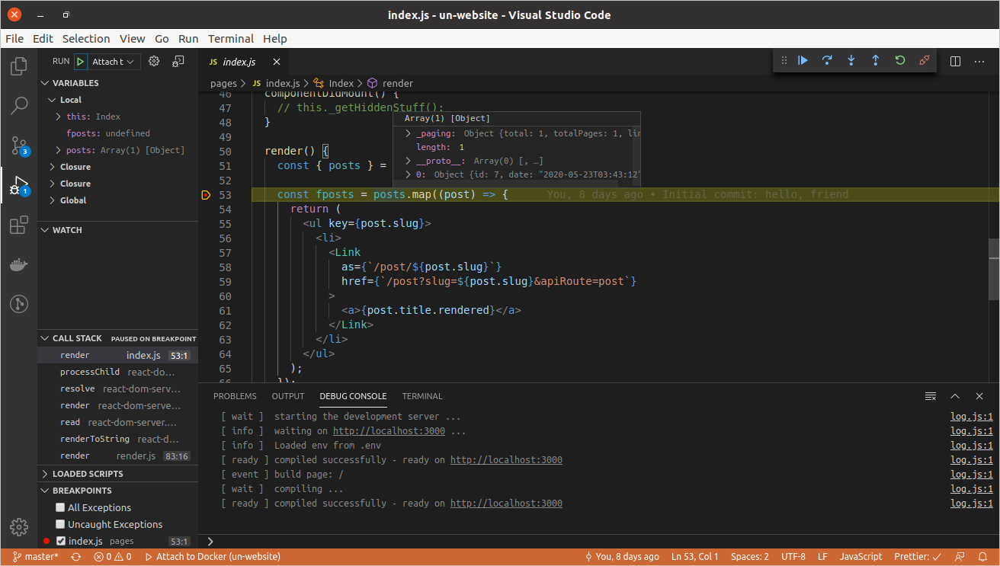

# Universal Native Website

[](https://travis-ci.com/universalnative/un-website) [](https://app.netlify.com/sites/jovial-shockley-a5e7ec/deploys) [](https://github.com/universalnative/un-website/blob/master/LICENSE)

Universal Native is a distributed community of volunteers working to democratize all information.

---

### Table of Contents

- [Architecture](#architecture)
  - [Application architecture](#application-architecture)
  - [Docker setup](#docker-setup)
- [Pre-reqs](#pre-reqs)
- [Environment Variables](#environment-variables)
- [Running](#running)
- [Content Authoring in WordPress](#content-authoring-in-wordPress)
- [Debugging](#debugging)
  - [App Code](#app-code)
  - [Database](#database)
- [Static Site Generation (SSG)](#static-site-generation-ssg)
- [Deploying](#deploying)
- [Testing](#testing)
- [Reinstalling WordPress](#reinstalling-wordpress)
- [CI/CD](#cicd)

---

### Architecture

#### Application architecture



This website uses modern headless CMS architecture. In essence, the app is created in [Next.js](https://nextjs.org/) - a server-side React framework - and uses WordPress as its data source.

While Next.js gives the flexibility to create highly customized web experiences in React, WordPress offers a familiar content publishing experience loved by millions. Next,js also comes with out-of-the-box support for static site generation, leveraging which we deploy our website as a static site on a network of CDNs (Netlify) for lightning-fast performance.

#### Docker setup

**Rationale:** As there are too many moving parts in the architecture, it makes sense to use a container for each moving part for ease of development and portability. That said, one may locally install all dependencies (WordPress and Database) of our app manually and develop it as a regular Next.js app.



Our Next.js app runs in Docker along with 3 other services, each running on a port as higlighted in the figure above. For details on running Docker containers for development, see the [Running](#running) section below.

There are two Docker Compose files. The main file is, as expected, `docker-compose.yml`, which should be used for local development. `docker-compose.ci.yml` is specific to CI environment, where mounting of host filesystem volumes is undesirable because of ensuing permission issues. See [cdc7877](https://github.com/universalnative/un-website/commit/cdc78771ff0ad214734af3b36636bdf987d4fe20).

---

### Pre-reqs

- Docker CE (on MacOS, Linux or Windows)
- VS Code

---

### Environment Variables

Almost all our Docker containers depend on certain environment variables. These can be set in your host OS or specified in .env file (in root folder).

For convenience, a `.env.example` file is included. You can start by making this your .env file:

```bash
$ cp .env.example .env
```

---

### Running

This application is containerized using Docker. Follow the steps below to run the app in Docker.

All commands assume you are cd'd into the root folder of this app (eg. "un-website").

> One may run it as a regular Node.js app locally (yarn start), but that is discouraged. This is because the app depends on a headless version of WordPress and a MySQL/MariaDB database, maintaining which separately would be bad for portability and having a consistent development environment.

1. Start all Docker containers:

```bash
$ docker-compose up
```

This command will take several minutes when run the first time. Subsequent runs will be much-much faster.

2. Once the **wp** container is up and running\*, visit http://localhost:8080/wp-admin. Log in using the credentials found inside .env.example file.

> \* You know the wp container is completely up when you see this message log in your console:
>
> `wp | [core:notice] [pid 1] AH00094: Command line: 'apache2 -D FOREGROUND'`

3. On logging into WordPress, create a couple of blog posts.

4. Once the **app** container is up and running\*, visit http://localhost:3000. You should see the posts you created above listed here.

> \* You know the app container is completely up when you see this message log in your console:
>
> `app | [ ready ] compiled successfully - ready on http://localhost:3000`

---

### Content Authoring in WordPress

> CPT UI and ACF presets specific to the Universal Native website can be found inside `setup` folder. These can be imported in WordPress via the **Tools** page of both plugins' settings.

WordPress comes with support for two (among others) content types (aka [post types](https://wordpress.org/support/article/post-types/)) -- pages and posts. Our headless WordPress currently supports **custom content types** and **custom fields**.

We may need more content types to help content authors easily manage content for our frontend pages.

Examples of custom content types are:

- hero
- content section
- navigation link
- team member profile
- project

Thankfully, there are WP plugins such as [Custom Post Type UI](https://wordpress.org/plugins/custom-post-type-ui/) to help create and manage custom content types in a user-friendly way. The plugin [takes care](https://developer.wordpress.org/rest-api/extending-the-rest-api/adding-rest-api-support-for-custom-content-types/) of exposing custom content types in WP-API.

And then there WP plugins such as [Advanced Custom Fields](https://www.advancedcustomfields.com/) to help create and manage custom fields in a user-friendly way. We can optionally combine club this plugin along with [ACF to WP-API](https://wordpress.org/plugins/acf-to-wp-api/) plugin to control WP-API output.

The first 5-6 mins of this video provide a good overview of using CPTUI and ACF plugins together:

[](https://www.youtube.com/watch?v=MM9sSN4wLtY)

---

### Debugging

#### App Code

When the App container is up, the Node process starts listening on port 7841 for connection to debugger. Configuration (`.vscode/launch.json`) has been provided to attach VS Code debugger to this port.



1. While the App container is running, go to Run sidebar and click the green play button against "Attach to Docker" dropdown option. Alternatively, press F5.
2. Add a few breakpoints in, say, Index page (`pages/index.js`).
3. Visit the page in browser to hit the breakpoint.

#### Database

[phpMyAdmin](https://www.phpmyadmin.net/) runs in a Docker container alongside the app. PMA is a useful tool to visualize the WordPress' database and potentially troubleshoot issues.

Visit http://localhost:8081 to open PMA. Login credentials are the values for `WORDPRESS_DB_USER` and `WORDPRESS_DB_PASSWORD` variables as specified in your .env file.

---

### Static Site Generation (SSG)

The ultimate goal of this website is to show information related to **Universal Native** - about, team, projects, articles, podcasts, and so on. Although its content is 'dynamic' in traditional sense of the word, if we come to think of it the content is not as dynamic as say on a news or ecommerce website. Once an article is published, it will rarely be modified. That is even truer for very static pages such as about, team, contact, etc.

With this in mind, we decided against running the website as a Next.js app. Instead we opted to use Next.js' built-in static site generator to output purely static assets (HTML, CSS, JS, images, etc.) that could be deployed to a CDN. If done right, doing so results in sub-second page loads to most users.

We use [Netlify](netlify.com/) to host our statically generated site. Every time a new commit is pushed or new content is published through our WordPress instance, a new SSG build is triggered on Netlify. And if all goes well, the build is then automatically deployed to production.

Refer this Smashing Magazine article on why SSG is a good idea:  
https://www.smashingmagazine.com/2015/11/modern-static-website-generators-next-big-thing/

---

### Deploying

There are multiple ways to deploy the site. The recommended way is to:

- run our version of headless WordPress as a Docker container on a cloud VM that supports Docker
- deploy the Next.js app with SSG support on something like Netlify or Vercel

AWS EC2, GCE, Digital Ocean, all are good options for this setup.

Another way is to run the app and all its dependent services (eg. WordPress) as Docker containers on Kubernetes cluster. SSG is still recommended with this setup. Again, AWS and GCE provide industry-leading options for such a setup.

Yet another way is to run each service as a separate app in regular (non-container) mode.

---

### Testing

Run unit tests like so:

```bash
$ yarn test
```

---

### Reinstalling WordPress

This can be done without destroying all containers and their volumes, and then re-creating them. WordPress installation is done using our custom `install_wordpress.sh` script (inside `docker` folder). This script checks the status of WP's database to decide whether installation should be performed. So installation is performed only when database is empty or it does not exist.

In short, follow these two steps to reinstall WordPress:

1. Reset the database (first "wp" is the name of WordPress container):

```bash
docker exec wp wp db reset
```

If `install_wordpress.sh` was modified, rebuild WordPress container to ensure the updated file is copied to the container.

> We are not following the "volume" approach to copy this script as seen in Postlight's [docker-compose.yml](https://github.com/postlight/headless-wp-starter/blob/master/docker-compose.yml). This is because of permission issues when running Docker on Linux. Things probably run fine with volume approach on macOS and Windows, though.

```bash
docker-compose build wp
```

2. Restart WordPress container.

---

### CI/CD

Our website uses [Travis CI](travis-ci.com/) for continuous integration. Our CI pipeline primarily runs linting and unit tests to ensure code quality. A CI build is triggered automatically when a commit is pushed to this repo.

For CD, we use Netlify.

---

Copyleft 2020 • MIT licensed  
Team Universal Native team@universalnative.org
